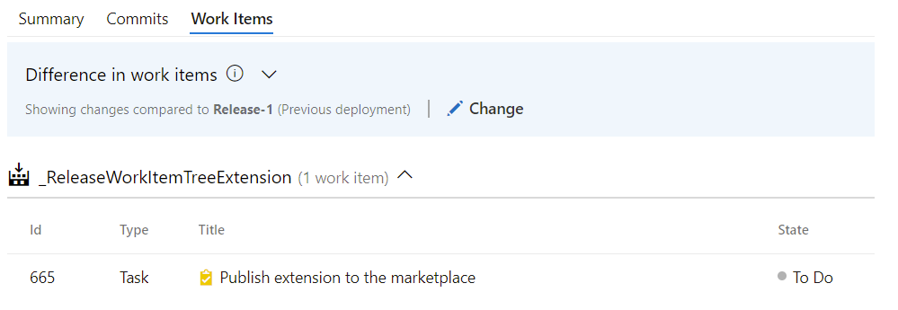
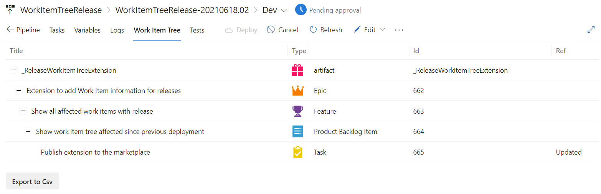

This extension shows all the work items that are related to a release.

By default, only the Work Items that are related are shown with the deployments:

With this extension, your deployment will show an extra tab next to the Logs tab. This tab will show the complete tree of work items related. So, if you relate your commit to a task, it will show the parents of the tasks as well:

With the button Export to Csv, the complete table will be exported to a csv file.
