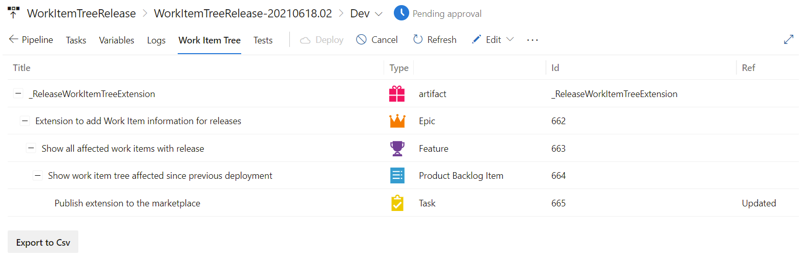

# Show a tree view of the work item difference

Lists the work item difference between the current release and the previously deployed release for a stage. It will show the Work Items including all the parents.

With this extension, your deployment will show an extra tab next to the Logs tab. This tab will show the complete tree of work items related. So, if you relate your commit to a task, it will show the parents of the tasks as well.

With the button Export to Csv, the complete table will be exported to a csv file.

By default, only the Work Items that are related are shown with the deployments:

